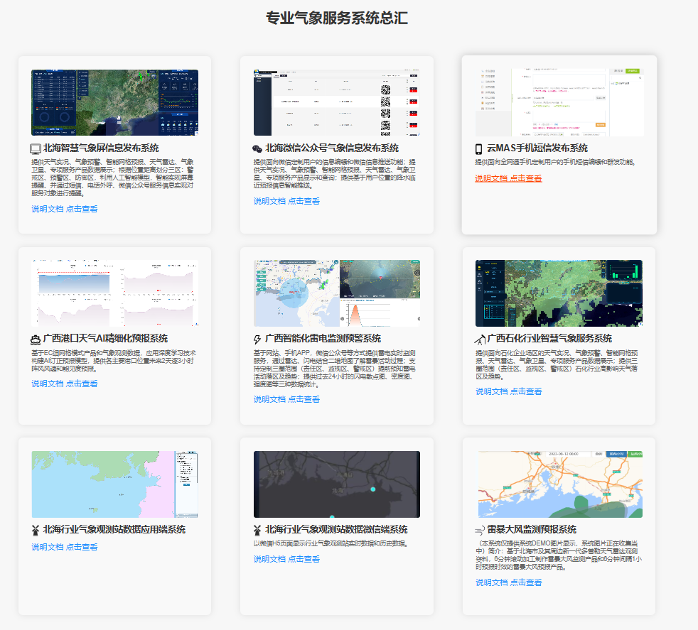
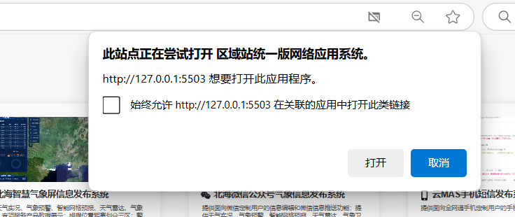
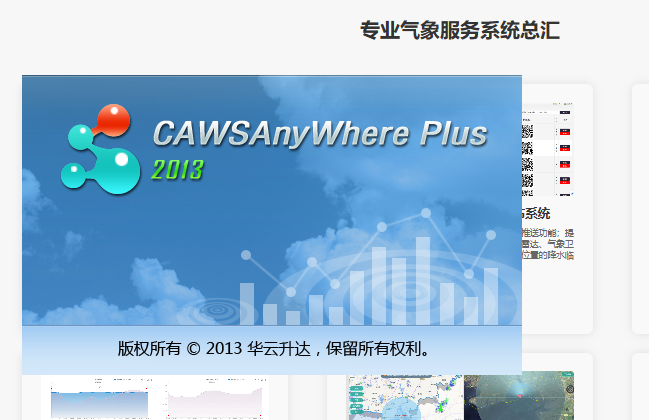
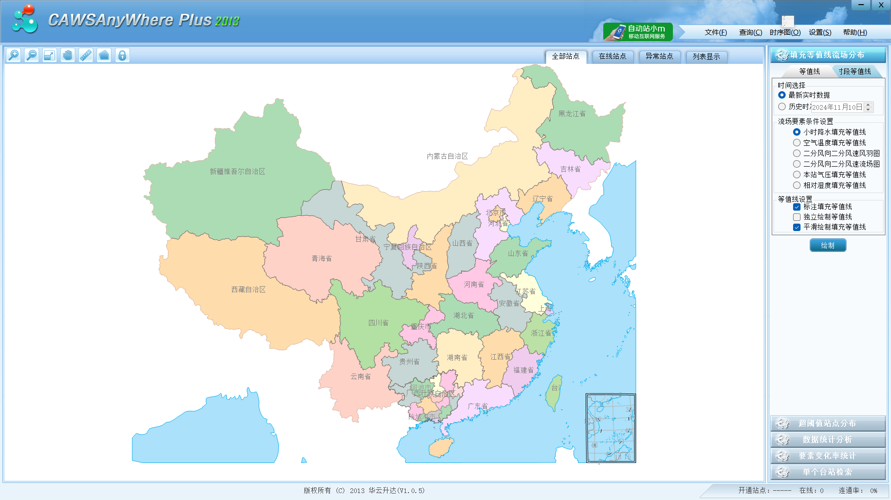

# 专业气象服务系统总汇

此项目整合多种气象服务系统，提供专业化的天气数据和预警服务，适用于多行业需求。**项目的独特技术**是通过注册表配置与 JavaScript 文件联动，用户可以直接从浏览器调用并打开本地应用程序，实现网页与本地应用的无缝连接。该系统通过 Vue.js 前端框架开发，采用模块化设计，便于维护和扩展，使用现代化样式，界面友好。

> 声明：各项目文档与CS应用程序涉及机密，未提供给出。但用户可根据本项目的技术实现自行学习如何在浏览器中启动本地应用程序。

## 亮点功能
1. **浏览器调用本地应用程序**：基于 `openCS.js` 文件中的逻辑和系统注册表配置，项目可在 Windows 系统的多种浏览器（如 Chrome、Firefox、Edge）中检测系统环境并自动打开本地应用。此功能简化了用户操作，为特定需求场景（如气象数据查看）提供快速响应。
2. **多系统集成**：系统包含多个气象服务模块，涵盖微信、短信、AI 精细化预报等多个应用，满足不同类型的气象数据需求。
3. **自适应网页设计**：响应式布局，适配多种设备，提供稳定流畅的浏览体验。
4. **文档支持**：各模块附带详细的说明文档，用户可快速上手，轻松操作。

## 技术实现细节
- **注册表配置**：项目提供的 `openCS.reg` 文件用于配置系统注册表，支持从浏览器中直接调用 `Webshell://` 协议来启动应用。该文件确保浏览器能识别并打开指定的本地应用。
- **`openCS.js` 文件逻辑**：`openCS.js` 文件中包含检测用户浏览器和设备的逻辑代码，通过检查操作系统和浏览器类型来判断是否支持应用调用。如果条件满足，则通过特定的 URL 方案实现直接打开应用；如果不支持，则给出相关提示。此机制确保了操作的兼容性和灵活性。

## 使用说明
1. 解压项目文件，将文件夹放置到所需目录。
2. 运行 `openCS.reg` 文件以完成注册表配置（仅 Windows 系统）。
3. 打开 `index.html` 文件后，通过网页点击即可直接启动本地应用。

## 截图

---